# 👋 Hi, I'm Yoskie

### 💻 Full-Stack Web Developer

Computer Science graduate focused on building responsive, user-friendly, and full-stack web applications.

---

## 💻 Tech Stack

### Frontend

### UI & Styling

### Backend

### Database & ORM

### Tools & Deployment

---

## 📊 GitHub Stats

---

## 🌐 Portfolio

---

## 📫 Connect With Me

I'm interested in opportunities where I can continue developing my skills and contribute to real-world software projects.

